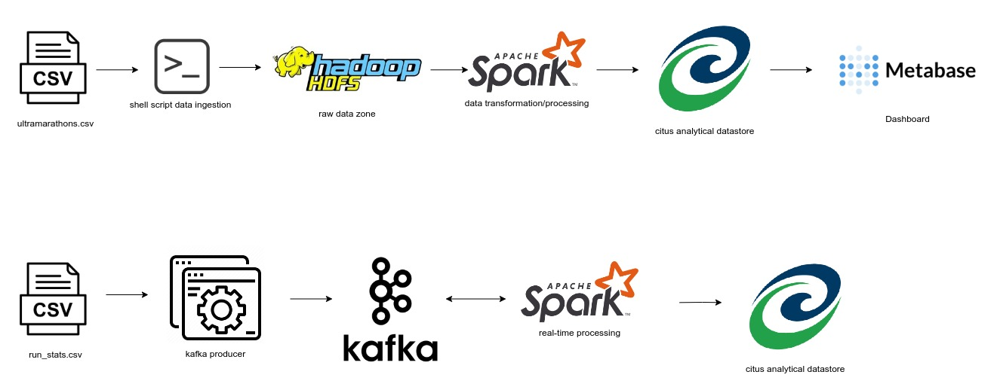

# Running analysis

## About
- Analysis of dataset of ultramarathon races spanning from 1798. to 2022. 
- Real time tracking of runners performance, that also incorporates information extracted from batch dataset
- Used datasets: 
    - batch: https://www.kaggle.com/datasets/aiaiaidavid/the-big-dataset-of-ultra-marathon-running?select=TWO_CENTURIES_OF_UM_RACES.csv
    - stream: https://data.world/jarnoma/half-marathon

## Infrastructure

- Raw batch data is stored on HDFS, processed with pyspark and stored inside Citus analytical database. Results are displayed using Metabase.

## Running application

- Starting batch processing: run script `/batch/execute_batch.sh`
- Starting stream producer: run command ` go run /stream/producer_consumer/producer`
- Starting stream processing: run script `/stream/start_all.sh`
